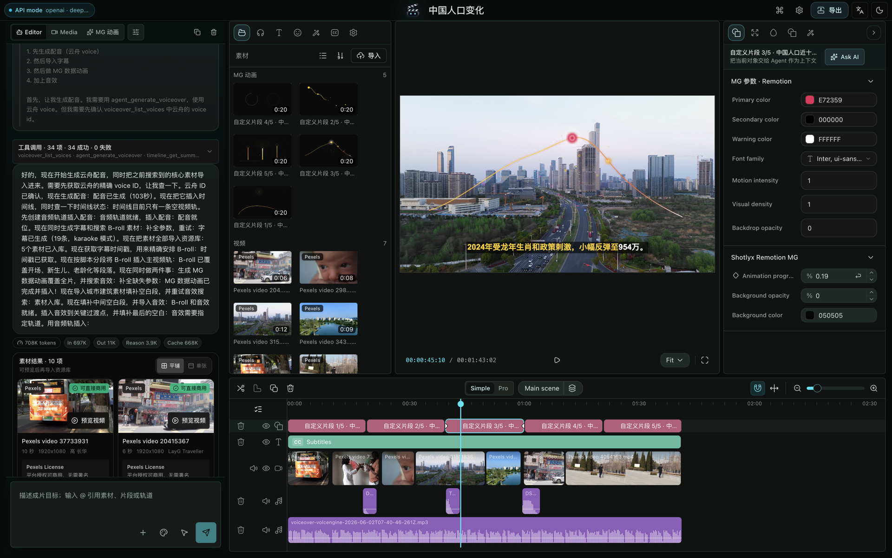
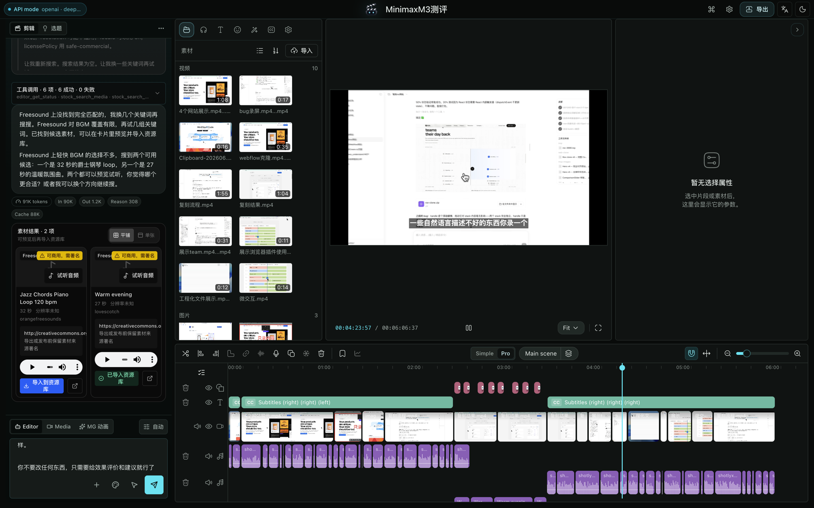
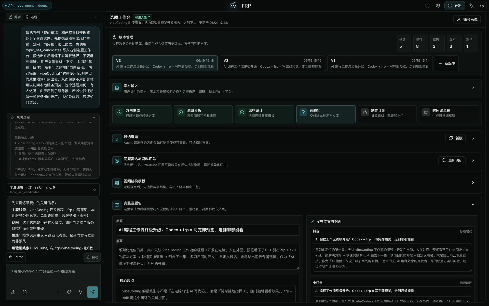
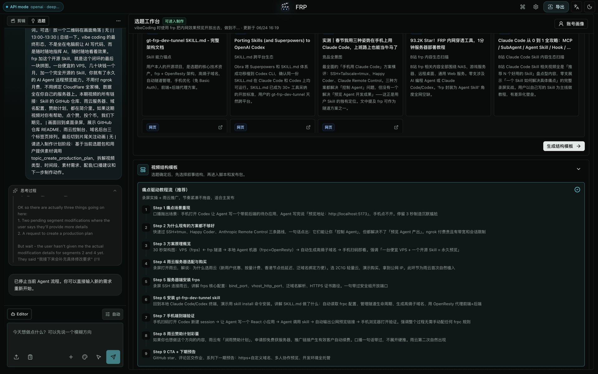

# Shotlyx

<p align="center">
  
</p>

[English](README.md) | 简体中文

Shotlyx 是面向技术创作者的本地优先、Agent-native 桌面视频编辑器。它把可视化时间线与可选 AI Agent 结合起来：Agent 能理解当前项目上下文，并通过明确、可审查的编辑器工具执行操作。

Shotlyx 是桌面应用，不是托管服务。剪辑、项目存储、本地媒体处理和进程内 API 都不依赖账号或 Shotlyx 后端。

> **Alpha：** 当前版本线为 `v0.1.0-alpha.1`。项目兼容性、打包方式和高级 AI 工作流仍可能调整。

## 产品预览

<p align="center">
  
  <br />
  <sub><strong>Agent 辅助创作</strong>——在同一个工作区完成配音、字幕、素材剪辑和可编辑动态图形。</sub>
</p>

<p align="center">
  
  <br />
  <sub><strong>专业时间线</strong>——通过多层视频、字幕、语音片段与音乐精细处理长视频。</sub>
</p>

<p align="center">
  
  <br />
  <sub><strong>选题工作台</strong>——从素材和调研逐步形成可审查、可复用的完整选题包。</sub>
</p>

<p align="center">
  
  <br />
  <sub><strong>制作结构</strong>——把调研结果整理为可复用、可执行的分步骤视频方案。</sub>
</p>

## 无需联网即可使用

- 时间线剪辑、预览、本地导入、文字、字幕、蒙版、特效、关键帧、音频工具与导出。
- 项目以可见 `.shotlyx` 目录保存在用户电脑上。
- Rust/WASM 与 FFmpeg 驱动的本地媒体处理。
- 只使用系统字体，不下载字体包，也不下载本地 AI 模型。

AI 和媒体 Provider 都是可选能力。未配置 Agent 时，编辑器仍然可用，并明确显示“Agent 可选”。

## 项目存储

默认项目库：

- macOS：`~/Documents/Shotlyx Projects`
- Windows：用户的 `Documents\Shotlyx Projects` 目录

每个项目都是可见目录：

```text
my-project-<id>.shotlyx/
├── project.json
└── media/
    └── managed/
```

通过原生文件选择器导入的文件默认保持外链；生成、录制、处理、粘贴和拖拽导入的媒体保存在项目内部。外链素材支持重新定位和归档到项目。

详细格式见[项目格式](docs/PROJECT_FORMAT.md)。

## 可选 Provider

核心适配器：

- Agent 模型：OpenAI、Anthropic、Google、OpenAI-compatible。
- 本地 Agent：Claude Code、Codex CLI。
- ASR：OpenAI-compatible、火山引擎。
- TTS：OpenAI-compatible、Edge TTS、火山引擎。
- 图片生成：OpenAI-compatible。
- 可编辑动态图形：Shotlyx MG。

实验性适配器：

- Kimi 视觉理解。
- Seedance 视频生成。
- 网页搜索/抓取。
- 第三方素材库。

只有用户主动执行相关操作时才会调用 Provider。API Key 使用 Electron
`safeStorage` 加密，可读配置文件只保存非敏感偏好。详见
[隐私说明](PRIVACY.md)。

## 架构

```text
apps/desktop     Electron 主进程、app:// 协议、安全存储和打包
apps/renderer    React/Vite 编辑器与本地路由处理
packages/local-api
                 Electron 使用的进程内请求分发器
packages/shared  跨包共享协议
rust             Rust crates 与 WebAssembly 包
```

项目没有远程 Shotlyx 后端。Electron 在应用进程内提供渲染层和本地 API。编辑器状态变更由 `EditorCore` 持有；可选 Agent 只提出工具调用，再由渲染层对当前项目执行。

更多说明见[架构文档](docs/ARCHITECTURE.md)。

## 开发

要求：

- Bun `1.2.x`
- Rust stable
- `wasm-pack`
- 当前官方桌面目标：macOS ARM64、Windows x64
- 媒体处理和打包需要兼容的 FFmpeg/FFprobe

安装并构建：

```bash
bun install
bun run build:desktop
```

运行桌面端：

```bash
bun run dev:desktop
```

无需配置 Provider。可选开发环境变量见
[`apps/renderer/.env.example`](apps/renderer/.env.example)。

常用检查：

```bash
bun run test
bun run lint:renderer
cargo test --workspace
bun run build:desktop
```

## 预览包

当前只生成未签名、未公证的预览包：

```bash
bun run dist:desktop:mac   # macOS ARM64，请在 macOS ARM64 构建
bun run dist:desktop:win   # Windows x64，请在 Windows x64 构建
```

打包命令不会上传产物，应用也没有自动更新。正式发布前必须通过 FFmpeg
架构、校验和、源码地址、版本和许可证检查，具体见
[`resources/ffmpeg/README.md`](resources/ffmpeg/README.md)。仓库不提交 FFmpeg
二进制。

## 当前限制

- Alpha 包未签名，系统可能显示安全警告。
- 渲染层无法稳定取得拖拽文件的绝对路径，因此拖拽文件会复制到项目内部；需要外链时请使用“导入”按钮。
- 不内置本地 Whisper 或其他 AI 模型。
- 实验性 Provider 可能调整或移除。
- macOS Intel 与 Linux 暂不是本 Alpha 的官方打包目标。

## 参与贡献

项目使用 Developer Certificate of Origin，不使用 CLA。请阅读
[CONTRIBUTING.zh-CN.md](CONTRIBUTING.zh-CN.md)，提交时加入
`Signed-off-by`，并遵守[行为准则](CODE_OF_CONDUCT.md)。

安全问题请按 [SECURITY.md](SECURITY.md) 私下报告。

## 许可证与归属

Shotlyx 使用
[GNU GPL version 3 only](LICENSE)（`GPL-3.0-only`），不提供双重授权，也不要求 CLA。

代码许可证不授予 Shotlyx 名称和品牌标识的使用权。派生项目应使用不同品牌，详见 [TRADEMARK.md](TRADEMARK.md)。

Shotlyx 包含基于 OpenCut MIT 许可证的派生代码，原始许可证保存在
[`licenses/OpenCut-MIT.txt`](licenses/OpenCut-MIT.txt)。分发说明见
[THIRD_PARTY_NOTICES.md](THIRD_PARTY_NOTICES.md)。
